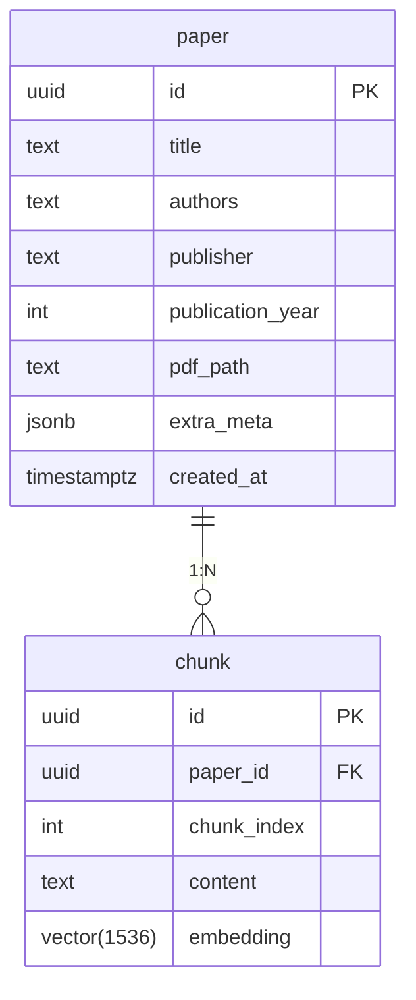

# AI 연동을 위한 데이터베이스 구축 계획

> **목표**: 수집된 논문 메타데이터와 전문(PDF)에서 추출한 임베딩(Embedding)을 저장·관리하여, 향후 RAG-기반 검색·챗봇 시스템과 원활히 연동할 수 있는 DB 인프라 설계

---

## 1. 기술 스택 선정
| 영역 | 선택 | 선정 이유 |
|------|------|-----------|
| RDBMS | **PostgreSQL 16.x** | ACID, JSONB·Full-Text Search, pgvector 확장 지원 |
| 벡터 확장 | **pgvector** | 최대 16K 차원, cosine/L2, ANN 인덱스(HNSW) 지원 |
| ORM | **SQLModel (FastAPI 기반)** | Pydantic + SQLAlchemy 융합, 타입 안전 |
| ETL | **LangChain / LlamaIndex** | PDF ↔ 텍스트 분할·임베딩 파이프라인 구축 |
| 임베딩 모델 | **OpenAI ada-002 → 로컬(옵션: InstructorXL)** | 초기엔 API, 추후 자체 모델 전환 용이 |

---

## 2. 스키마 설계


### 설명
1. **paper**: 논문 단위 메타데이터 테이블 
   * `extra_meta` 컬럼에 키워드·학회·DOI 등 가변 데이터를 JSONB로 저장
2. **chunk**: PDF를 청크 단위로 분할(예: 1,000자)한 텍스트 및 임베딩 벡터 보관
   * `embedding` 컬럼 pgvector 타입 → ANN 인덱스 생성 `USING hnsw`
   * 동일 논문 안에서 `chunk_index` 로 순서 유지

---

## 3. 구축 단계
1. **PostgreSQL 인프라**
   ```bash
   docker run -d --name pgdb -e POSTGRES_PASSWORD=pass \
     -p 5432:5432 ankane/pgvector:latest
   ```
2. **데이터베이스 초기화 스크립트** (`scripts/init_db.py`)
   * SQLModel 모델 정의 → `SQLModel.metadata.create_all(engine)`
   * `CREATE EXTENSION IF NOT EXISTS vector;` 실행
3. **크롤러 파이프라인 확장**
   1) PDF → 텍스트 추출 (`pdfminer.six`)
   2) LangChain `RecursiveCharacterTextSplitter` 로 분할
   3) OpenAI 임베딩 후 `chunk` 테이블 bulk-insert
4. **검색 API** (`/search?q=...&top_k=5`)
   * 벡터 검색: `SELECT *, embedding <-> :query_vec AS dist FROM chunk ORDER BY dist LIMIT 5;`
   * 결과 청크 관련 `paper` 조인 후 프론트 반환
5. **챗봇/RAG**
   * FastAPI WebSocket 엔드포인트 추가, streaming response
   * Retrieval: pgvector ANN → context → GPT-4o prompt

---

## 4. 운영 & MLOps
* **백업**: wal-g로 S3 주기 백업, PITR 설정
* **모델 버저닝**: Weights & Biases or HuggingFace Hub
* **모니터링**: pg_stat_statements + Grafana / Prometheus
* **CI**: GitHub Actions → 마이그레이션(Alembic) 자동 적용

---

## 5. 향후 로드맵                                     
1. PDF 이미지 페이지 OCR(Tesseract) 병합
2. 요약문·키프레이즈 자동 생성 및 컬럼 추가
3. 사용자 피드백 기반 임베딩 Re-training 파이프라인
4. 논문 간 인용 네트워크 그래프 테이블 구축

---

> 문의 또는 수정 제안이 있으면 Issues나 슬랙 채널에 남겨주세요. 